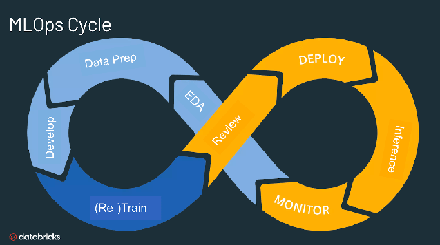

# Hands-on MLOps



Welcome to the Hands-on MLOps Curriculum repository! This repository contains practical exercises and examples to help you learn MLOps concepts using various toolkits including Ray, MLflow, Optuna, DVC, and LIME for model interpretability.

## Table of Contents

1. [Introduction](#introduction)
2. [Toolkits Overview](#toolkits-overview)
3. [Setup Instructions](#setup-instructions)
4. [Running the Notebooks](#running-the-notebooks)
5. [Contributing](#contributing)
6. [License](#license)

## Introduction

This curriculum is designed to provide hands-on experience in implementing MLOps practices using state-of-the-art toolkits. Whether you're new to MLOps or looking to deepen your knowledge, these exercises will guide you through practical examples that demonstrate the integration of machine learning models with deployment pipelines, experiment tracking, hyperparameter tuning, version control, and model interpretability.

## Toolkits Overview

### Ray

Ray is a distributed computing framework that helps you scale your machine learning applications across multiple CPUs or GPUs. It provides simple APIs for parallel and distributed Python applications.

### MLflow

MLflow is an open-source platform for managing the end-to-end machine learning lifecycle. It supports experiment tracking, reproducibility, and deployment of models from various ML libraries.

### Optuna

Optuna is an automatic hyperparameter optimization framework. It simplifies the process of finding optimal hyperparameters for machine learning models using state-of-the-art algorithms.

### DVC (Data Version Control)

DVC is an open-source version control system for data science and machine learning projects. It helps you manage datasets, models, and experiments with Git-like commands.

### LIME (Local Interpretable Model-agnostic Explanations)

LIME is a library for explaining the predictions of machine learning models. It provides insights into how models make decisions at the individual prediction level, enhancing model interpretability.

## Setup Instructions

To get started with the Hands-on MLOps Curriculum, follow these steps:

1. **Clone the repository:**
   ```bash
   git clone https://github.com/AdityaKulshrestha/MLOps.git
   
   cd MLOps
   ```

2. **Install dependencies:**
    We recommend creating a virtual environment (e.g., using virtualenv or conda) and installing the required dependencies:

    ```bash
    python -m venv practical_mlops
    source practical_mlops/bin/activate # for linux
    pip install -r requirements.txt
    ```

3. **Start Jupyter Notebook:**
    Launch Jupyter Notebook to access the exercises and examples:

    ```bash
    jupyter-notebook
    ```
    Open browser navigate to ML/Handson_MLOps.ipynb

4. **Run the mlflow server**
    Launch the mlflow ui server:

    ```bash
    mlflow server --host 0.0.0.0 --port 8000
    ```

## Running the Notebooks
The notebook in this repository corresponds to a specific topic or exercise related to MLOps. They include code examples using the aforementioned toolkits to demonstrate concepts such as:

- Distributed computing with Ray
- Experiment tracking and model packaging with MLflow
- Hyperparameter optimization with Optuna
- Versioning datasets and models with DVC
- Model interpretability using LIME

Follow the instructions within each notebook to execute the code and observe the results. Feel free to modify the code and experiment with different parameters to deepen your understanding.